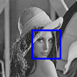
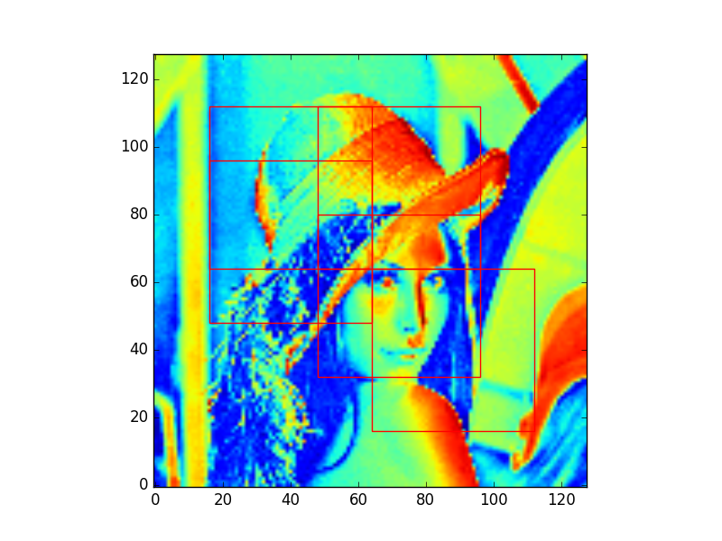
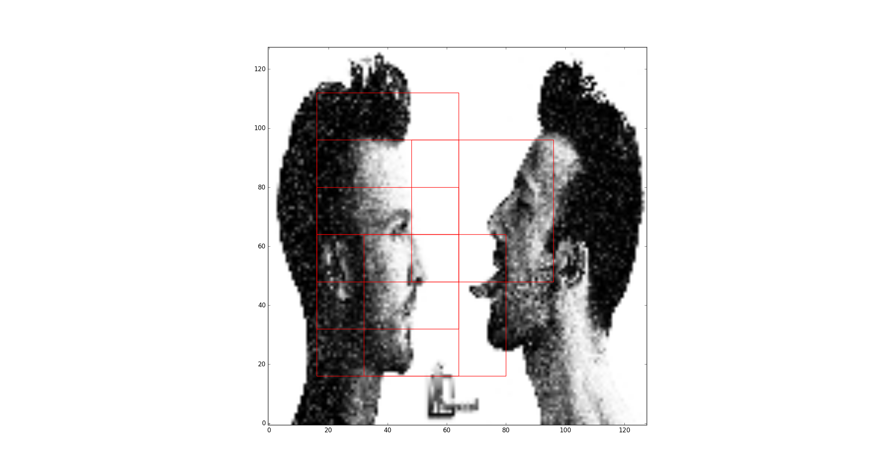
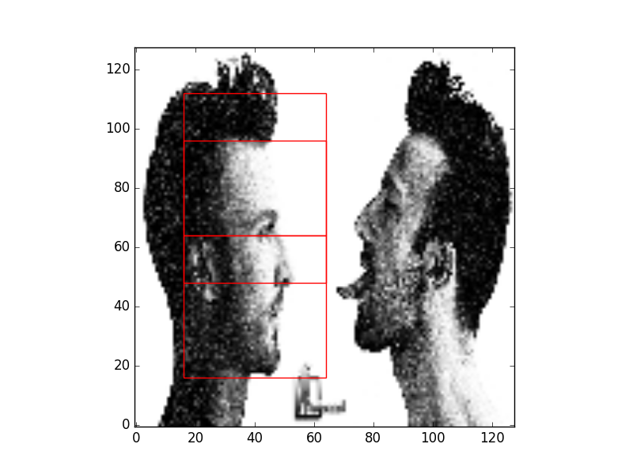
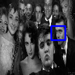
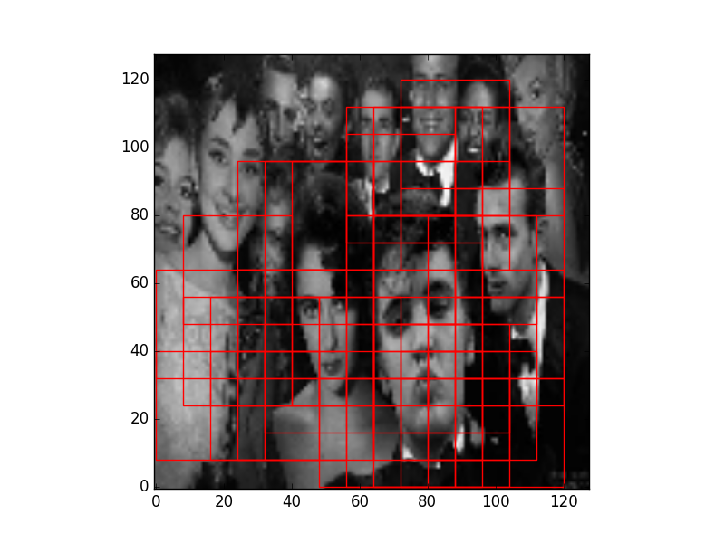
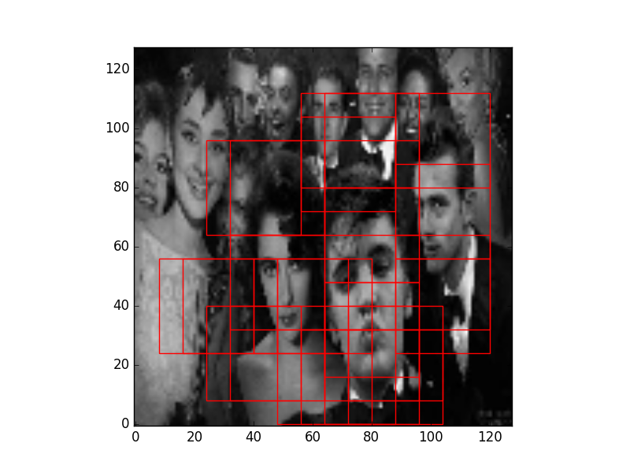

## Face Detection using Deep Learning

- 153079004 Ashish Sukhwani
- 153079011 Akshay Khadse
- 153079005 Raghav Gupta
- 15307R001 Soumya Dutta

### Downloads

- [Proposal](documentation/project_proposal.pdf)
- [Mid-Term Presenatation](documentation/midterm_presentation.pdf)
- [Mid-Term Report](documentation/midterm_report.pdf)
- [Final Presentation](documentation/final_presentation.pdf)
- [Final Report](documentation/final_report.pdf)
- [Trained Models](https://mega.nz/#F!8aZWnSQY!dQX2bwsdb546pD2hc7eUIA)


### Introduction

With recent technological advances, photographs have become most convenient and preferable medium of expression. Millions of photos make their way to various cloud storage and social networks every day. Retrieving and organising these photos impacts user experience and is very challenging.

Some solutions like geo-tagging allows photos to be organised by locations, but doing so on basis of some contextual queries like 'photos with a particular friends', etc. is much more difficult. This is because such queries require detection of human faces. There is no particular signal associated about the identities of people making this task much more difficult.

Photographs are 2D projections of 3D objects like faces. The human face is not a unique rigid object. There are billions of different faces and each of them can assume a variety of deformations. Inter-personal variations can be due to race, identity, or genetics while intra-personal variations can be due to deformations, expression, aging, facial hair, etc. We have taken the problem of multiview face detection in given image for this course project. However, identification was not considered as it would require more time and computational resources.

Face detection has been an active research are for past two decades. Well established techniques are available which enable detection of upright faces in real time with very low computational complexity. These involve cascade simple to complex face classifier. Many variants of these have been implemented in smartphones and digital camera. However, these techniques fail to detect faces with different angle and partial faces.

### Existing Methodologies

From our survey we noted that one of the most successful methods for face detection was devised in [[1](#references)]. The method described uses Haar feature based Cascade Classifers. For the classifiers to work the first step is feature extraction. Haar features are extracted from the images in order to construct the feature vector of each image. However the number of features that we get from images in this way are fairly large.

For feature selection Adaboost algorithm is used. Finally we get a classifier which is a weighted sum of each classifier in each step. This classifier is correctly able to detect faces as reported in [[1](#references)].

However although this method works very well for images with frontal faces, the results are not satisfactory for images with other views. Thus, using this method for multiview detection poses several challenges, which we try to overcome in our project.


### AFLW Dataset Link

https://lrs.icg.tugraz.at/research/aflw/


### Method Described in Paper [[2](#references)]

Paper [[2](#references)] describes finetuning of Alexnet for face detection. For this AFLW dataset which consists of 21k images with 24k face annotations was used. Number of positive examples was increased by randomly sampling sub windows of the images. Intersection of Union(IOU) with ground truth was found with each such image, images which had more than 50% IOU were taken as positive examples. This resulted in 200k positive examples and 20 million negative examples. All image were resized to 227 X 227. For finetuning of Alexnet, a batch size of 128 image containing 32 positive and 96 negative examples was used for 50k iterations.

To realise final phase detector from this finetuned Alexnet, either region based or sliding based approach can be followed. Paper describes selection of sliding window approach because of its less complexity.

This face detector consists of five convolutional layers and three fully connected layers. The original author used caffe framework for implementing this strategy.

Paper also presents comparison of this method with R-CNN. For this purpose Alexnet was trained as described earlier, but output of fully connected layer was reshaped and used for training a SVM classifier. A bounding box regression unit was also trained to further improve results. This was repeated for Alexnet finetuned for PASCAL-VOC 2012 which involves recognition of objects and not particularly faces.It was observed that face trained Alexnet perform better than pascal-VOC Alexnet. Paper also mentions significant improvement of R-CNN due to bounding box regression. However, this performance was not as good as the method developed in this paper. Inferior performance of R-CNN can be due to

-   R-CNN method used selective search leading to missing out some of the face regions. 
-   Loss in localisation due to imperfection in bounding box regression.


### Methodology

The method that we have followed is described under two heads:-

- **Data Collection and Pre-processing**: We used the same dataset as used by [[2](#references)]. The AFLW dataset is not open for usage and can     be accessed only for academic purposes. After getting the dataset we preprocess each image according to our need. Handling images of the dimension of 227 X 227 X 3 was computationally difficult for us. Thus we reduced each image to 128 X 128 1. Thus our face detector will be able to handle only grayscale images.
- We then augmented our dataset in the same way as described in [[2](#references)] and described in Section 3. However we took around 24k positive and around 120k negative examples.
- **Our network**: Although [[2](#references)] uses a pre-trained AlexNet model for the face detector, we create our own Deep Convolutional Neural Network using Tensorflow. We have used a batch size of 60. Each such batch has 45 negative examples and 15 positive examples. The architecture of our CNN cannot be too adventurous keeping in mind the computational complexity. We started out with 2 convolutional layers and 2 fully-connected layers we could not get suitable results even on our training dataset. Thereafter we fixed our network to have 3 convolutional layers and 3 fully-connected layers along with max-pooling. They are described below:-


Layer | Details
---------------------|--------------------------------------------------------------------
**CONV LAYER 1** | *Activation - ReLU Filter -  18 X 18 X 1 X 60 Bias - 60 Stride - 1 X 1*
**MAXPOOL LAYER1** | *Filter - 2 X 2 Stride - 2 X 2*
**CONV LAYER 2** | *Activation - ReLU Filter - 12 X 12 X 60 X 30 Bias - 30 Stride - 1 X 1*
**MAXPOOL LAYER2** | *Filter - 2 X 2 Stride - 2 X 2*
**CONV LAYER 3** | *Activation - ReLU Filter - 6 X 6 X 30 X 15 Bias - 15 Stride - 1 X 1*
**MAXPOOL LAYER3** | *Filter - 2 X 2 Stride - 2 X 2*
**FC LAYER 1** | *Activation - ReLU Weights - 3840 X 4096 Bias - 4096*
**FC LAYER 2** | *Activation - ReLU Weights - 4096 X 256 Bias - 256*
**FC LAYER 3** | *Activation - Sigmoid Weights - 256 X 1 Bias - 4096*

We have also experimented with sigmoid activation functions at each stage. However this has not given satisfactory training performance.

One of the major challenges that we faced while training the network was the problem of extremely small weight values. We had used the cross-entropy loss function along with a regularization parameter of 0.01 as our loss function. We used Adam Optimizer of Tensorflow for training. We noticed that although the cost is coming down, the training accuracy is fixed at 75%. This was not at all efficient as predicting all negatives in each batch will lead to this efficiency. As expected, this gave a similar accuracy of 75% in our test set as well. Therefore we modified the cost function slightly, multiplying the positive error by a constant > 3.5. Such a modification actually improves training accuracy of our system and we get accuracies of > 85%. We saved each of those models and run it on our test examples.

We noted that changing the regularization parameter also did not have much effect on the performance of our model on the test data.

### Dependencies

- `python3.5`
- `numpy`
- `tensorflow`
- `opencv`
- `matplotlib`

### Folder structure

```
project_folder
 |- face_detection_dataset/
 |   |- positive_bw/
 |   |- negative_bw/
 |- test_image/
 |- saved_model/
 |- train.py
 |- test.py
 |- preprocess.py
 |- draw_rect.py
 |- output.txt
 |- aflw_example.py
 |- haar.py
 |- haarcascade_frontalface_default.xml
 |- haarcascade_profileface.xml
```

#### `aflw_example.py`

- This script has to be run in order to generate face coordinates. This uses aflw.sqlite available from the dataset website.
- Coordinates are saved in output.txt

#### `preprocess.py`

- This script uses the coordinates stored in output.txt
- generates negative and positive images and stores them in negative_bw and positive_bw folder respectively.

#### `train.py`

- This script is used to train the neural network using preprocessed example from AFLW dataset.
- Saves trained model in saved_model folder.
- To use this script, run python3 train.py
- Dataset need to be as per above folder structure
- Validation is also performed in this script itself

#### `output.py`

- This script is used to test image and save diagonal co-ordinates of bounding boxes
- To use this script, image to be tested needs to be in test_image folder
- To run script use python3 output.py
- This will generate a text file faces.txt which contains all the bounding boxes for that particular test image.

#### `draw_rect.py`

- This script draws bounding boxes on test image according to faces.txt generated.
- To use this script python3 draw_rect.py
- Displays test image with bounding boxes over it

#### `haar.py`

- Uses xml files of haar cascade classifier from OpenCV to generate bounding boxes around faces of test images.

### Results

With the trained model we test it on some test images. We have also implemented Haar Cascade Classifier module from OpenCV and thus present a comparative study between our method and this famous method.

For testing images, our final task is to draw a rectangular box around detected faces in the test image. For this we first resize each image to 128 X 128 X 1. Now we crop parts of each test image (sample the image in boxes of 32 X 32 with a horizontal and vertical stride of 16). We resize each such window to 128 X 128 X 1 and apply our trained model on it. Depending on the value of our output neuron we draw a box on the original image. In this way our model is able to detect the faces in the original image. The performance of our model and the Haar Cascade classifier is shown below for some test images. Here we present performance of three of our saved models. They are as follows:-

-   **Model 1**: Training accuracy of 88.3333 %
-   **Model 2**: Training accuracy of 91.6667 %
-   **Model 3**: Training accuracy of 94.2857 %

<table>
  <tr>
  	<td></td>
    <td></td>
    <td></td>
  </tr>
  <tr>
  	<td></td>
  	<td></td>
  	<td></td>
  </tr>
  <tr>
    <td colspan="3">Our face detector performance-model 1 to 3 (left to right)</td>
  </tr>
</table>

<table>
  <tr>
  	<td></td>
    <td></td>
    <td></td>
  </tr>
  <tr>
  	<td></td>
  	<td></td>
  	<td></td>
  </tr>
  <tr>
    <td colspan="3">Our face detector performance-model 1 to 3 (left to right)</td>
  </tr>
</table>

We note that the results of one of our models is comparable to that of Haar Cascade Classifier in the case of a single face in the test image. Our model however outperforms the Haarcascade classifer in the case of Figure 2. Further we present the performance of our face detector for other complex test images.

<table>
  <tr>
  	<td></td>
    <td></td>
    <td></td>
  </tr>
  <tr>
  	<td></td>
  	<td></td>
  	<td></td>
  </tr>
  <tr>
    <td colspan="3">Our face detector performance-model 1 to 3 (left to right)</td>
  </tr>
</table>

We see that one of our models is able to detect the face of the left person. This is a very encouraging result. However the number of
non-faces being marked as faces is a concern. This may be because of the way we are sampling windows from the images. Taking a small window and resizing it into 128 pixels is blurring the image, thereby making the job of face detection even more difficult. We finally present a comparison of a test image with many (> 6 faces).

<table>
  <tr>
  	<td></td>
    <td></td>
    <td></td>
  </tr>
  <tr>
  	<td></td>
  	<td></td>
  	<td></td>
  </tr>
  <tr>
    <td colspan="3">Our face detector performance-model 1 to 3 (left to right)</td>
  </tr>
</table>

We note that while the Haar Cascade Classifier correctly recognizes 1 face among the many faces in the picture one of our detectors recognizes almost all the faces. However again we experience the problem of false positives in the detector.

### Conclusion

In this project we have designed a Deep Convolutional Neural Network using Tensorflow to detect faces from images. We have also done a
comparative study of the face detector with the other most famous detectors available, namely, Haar Cascade Classifer. Although we could not train the complex model used by the authors of [[2](#references)], we got results significantly superior to the the Haar Cascade Classifier
implemented in `OpenCV`.

However, training time of our network is much higher. Also, we are getting many false positives. Thus we can claim that although our model did not achieve the standards of the model as described in [[2](#references)], we got quite good performance from our model.


### Acknowledgement

We would like to thank Professor Ganesh Ramakrishnan for giving us the opportunity to select a Project of our choice as our Course Project for CS725. We would also like to thank our TA mentors Suhit and Ajay for their guidance.


### References

1. Jones, Michael, and Paul Viola. "Fast multi-view face detection." Mitsubishi Electric Research Lab TR-20003-96 3 (2003): 14.
2. Farfade, Sachin Sudhakar, Mohammad J. Saberian, and Li-Jia Li. "Multiview face detection using deep convolutional neural networks." Proceedings of the 5th ACM on International Conference on Multimedia Retrieval. ACM, 2015.
3. Zhang, Zhanpeng, et al. "Facial landmark detection by deep multi-task learning." European Conference on Computer Vision. Springer International Publishing, 2014.